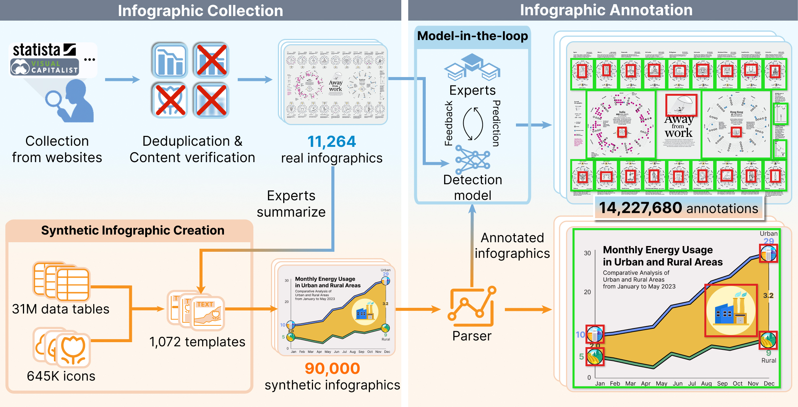

  

<h1>
  InfoDet: A Dataset for Infographic Element Detection
</h1>

  

> InfoDet is a dataset designed to support the development of accurate object detection models for charts and HROs in infographics. It contains 11,264 real and 90,000 synthetic infographics, with over 14 million bounding box annotations.

## 🔥 News
🎉🎉 We have released the first version of our dataset, which includes 11,264 real and 90,000 synthetic infographic charts, with over 14 million bounding box annotations.

## 📦 Dataset
**[👉 Access the full InfoDet dataset on Hugging Face 🤗! 👈](https://huggingface.co/datasets/InfoDet/InfoDet)**

InfoDet comprises a diverse collection of infographics from two sources: 1) real infographics collected from 7 online platforms, and 2) synthetic infographics programmatically created from 1,072 design templates.
To effectively annotate the infographics, we combine the model-in-the-loop and programmatic methods.

## 🎯 Applications

The effectiveness of InfoDet is demonstrated through three applications:

### Thinking-with-Boxes via Grounded Chain-of-Thought

We construct a Thinking-with-Boxes scheme to enhance VLMs by explicitly providing grounded annotations of texts, charts, and HROs along with additional layered infographic images.
For more details, please refer to this [folder](grounded_CoT). 

### Evaluating Object Detection Models

We compare 11 object detection models on InfoDet to assess their performance in detecting charts and HROs. 
The following figure shows detection results of evaluated object detection models: (a) zero-shot prompting with DINO-X; (b) 4-shot prompting with T-Rex2; (c) 4-shot fine-tuning with Co-DETR; (d) fine-tuning on InfoDet with Co-DETR. Bounding boxes in colors are the predictions for charts and HROs.
For more details, please refer to this [folder](model_evaluation). 

### Applying the Developed Model to Graphic Layout Detection

To demonstrate the broader applicability of InfoDet, we evaluate its effectiveness on graphic layout detection tasks by applying the InternImage-based model.
For more details, please refer to this [folder](graphic_layout_detection). 

## ⚖️ License
This project is released under the [Apache 2.0 license](LICENSE).

## 🤝 Contact
- igraphicdet@outlook.com
